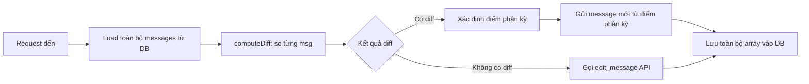
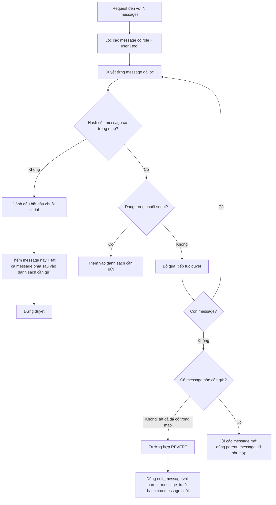
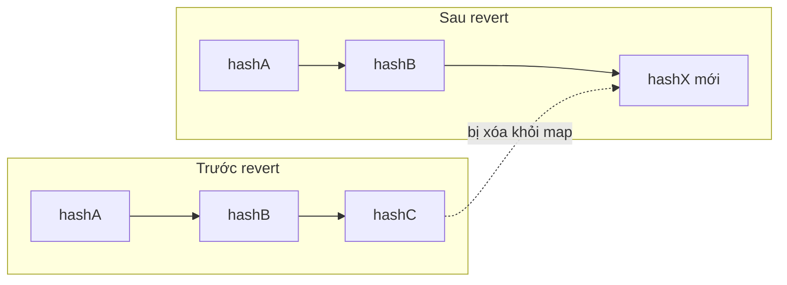
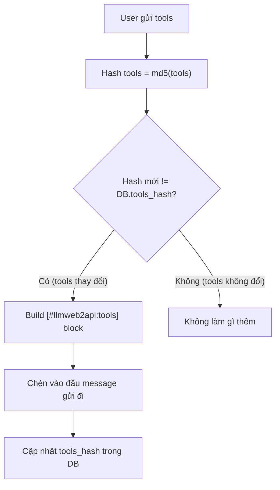
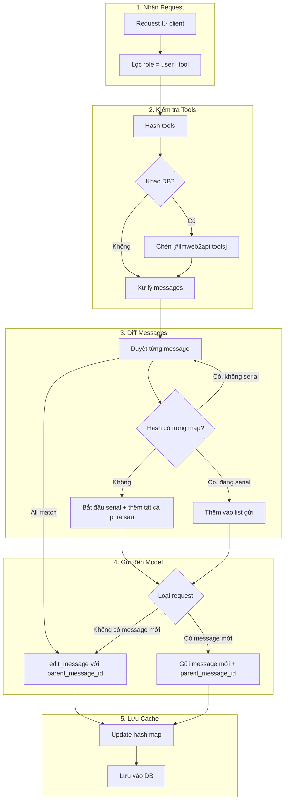

# Cải tiến Cache & Diff cho Conversation

## 1. Vấn đề hiện tại

### 1.1 Cách hoạt động hiện tại

Hiện tại, toàn bộ lịch sử tin nhắn được lưu dưới dạng JSON array trong column `messages` của bảng `conversations`. Mỗi khi có request mới, hệ thống:

1. Load toàn bộ `messages` từ DB/cache
2. So sánh từng message một (`computeDiff`) giữa `previous` và `current`
3. Nếu khớp hoàn toàn → gọi `edit_message` để regenerate
4. Nếu khác một phần → xác định điểm phân kỳ, gửi các message mới
5. Lưu lại toàn bộ array `messages` mới vào DB



### 1.2 Vấn đề

| #   | Vấn đề                                | Hệ quả                                                                                                                 |
| --- | ------------------------------------- | ---------------------------------------------------------------------------------------------------------------------- |
| 1   | **Dữ liệu quá lớn** khi hội thoại dài | Mỗi request phải load, serialize, so sánh toàn bộ lịch sử                                                              |
| 2   | **Revert gây tạo session mới**        | Khi user quay về 1 message cũ, lịch sử thay đổi → `computeDiff` phát hiện branch → tạo fresh session (không mong muốn) |
| 3   | **So sánh từng message kém hiệu quả** | `msgEquals` stringify từng message để so sánh, O(n) mỗi request                                                        |
| 4   | **Tools cũng bị diff toàn bộ**        | Mảng tools thay đổi là phải gửi lại toàn bộ system prompt                                                              |

### 1.3 Minh họa vấn đề revert

```
Lịch sử trong DB:    [msg1] → [msg2] → [msg3] → [msg4]
User revert về msg2: [msg1] → [msg2] → [msg5 mới]
                                  ↑ điểm phân kỳ
Kết quả: computeDiff phát hiện branch → tạo session mới → mất context
Mong muốn: dùng edit_message tại msg2, giữ nguyên session
```

---

## 2. Giải pháp đề xuất

### 2.1 Ý tưởng chính

| Hiện tại                           | Đề xuất                                                             |
| ---------------------------------- | ------------------------------------------------------------------- |
| Lưu **toàn bộ** message (mọi role) | Chỉ lưu hash của message có `role = user \| tool`                   |
| So sánh từng message một           | So sánh bằng hash map                                               |
| Lưu full JSON array                | Lưu hash map `{ hash → { parent_message_id, request_message_id } }` |
| Branch → fresh session             | Dùng `parent_message_id` để edit, giữ session                       |

### 2.2 Cấu trúc dữ liệu mới

Column `messages` trong DB thay vì lưu array message, sẽ lưu hash map:

```json
{
  "hash_a1b2c3": {
    "parent_message_id": null,
    "request_message_id": 1
  },
  "hash_d4e5f6": {
    "parent_message_id": 2,
    "request_message_id": 3
  },
  "hash_g7h8i9": {
    "parent_message_id": 4,
    "request_message_id": 5
  }
}
```

**Tại sao chỉ lưu role `user` và `tool`?**

- Đây là các message do người dùng gửi hoặc tool trả về (kết quả `call_tools` từ coding agent)
- Message `assistant` không cần cache vì được sinh ra bởi model, không ảnh hưởng đến việc xác định thay đổi

### 2.3 Luồng xử lý khi request đến



### 2.4 Ba trường hợp chính

#### Case 1: Message mới nối tiếp (Normal Append)

```
DB hash map:  { hashA, hashB, hashC }
Request:      [msgA] → [msgB] → [msgC] → [msgD mới]
Kiểm tra:     ✓       ✓       ✓       ✗ (chưa có)
Kết quả:      Gửi msgD với parent_message_id của hashC
```

#### Case 2: Revert về giữa lịch sử (Edit)

```
DB hash map:  { hashA, hashB, hashC }
Request:      [msgA] → [msgB] → [msgX mới]
Kiểm tra:     ✓       ✓       ✗ (chưa có)
Kết quả:      Xóa hashC khỏi map
              Gửi msgX với parent_message_id của hashB (dùng edit_message)
```



#### Case 3: Tất cả message đều có trong map (Full Match → Edit)

```
DB hash map:  { hashA, hashB, hashC }
Request:      [msgA] → [msgB] → [msgC]
Kiểm tra:     ✓       ✓       ✓
Kết quả:      Coi msgC là message mới
              Dùng edit_message với parent_message_id của hashB
```

### 2.5 Cache tool riêng biệt

```
Column mới: tools_hash trong bảng conversations

Khi user gửi tools mới:
  tools_hash_mới = md5(JSON.stringify(tools))

  Nếu tools_hash_mới != db.tools_hash:
    → Build block [#llmweb2api:tools] chứa tool definitions
    → Chèn vào đầu message sắp gửi đi
    → Cập nhật tools_hash trong DB
```



### 2.6 Thay đổi logic lưu cache

#### Thời điểm lưu

| Loại request   | Thời điểm lưu                                 |
| -------------- | --------------------------------------------- |
| **Non-stream** | Sau khi call model xong, update hash vào map  |
| **Stream**     | Khi có data stream đầu tiên, lưu hash vào map |

#### Dữ liệu lưu

- **Column `messages`**: Chỉ lưu hash map của các message tính đến trước message cuối (đã gộp)
- Lý do: qua web, mỗi request chỉ gửi 1 message, nếu có nhiều diff thì đã được gộp thành 1

```mermaid
flowchart TD
    subgraph "Non-stream"
        A1["Request đến"] --> B1["Xác định message mới"]
        B1 --> C1["Gọi model"]
        C1 --> D1["Có response"]
        D1 --> E1["Update hash của message mới vào map"]
        E1 --> F1["Lưu map vào DB"]
    end

    subgraph "Stream"
        A2["Request đến"] --> B2["Xác định message mới"]
        B2 --> C2["Bắt đầu stream"]
        C2 --> D2["Nhận chunk đầu tiên"]
        D2 --> E2["Update hash của message mới vào map"]
        E2 --> F2["Lưu map vào DB"]
        F2 --> G2["Tiếp tục stream..."]
    end
```



---

## 3. Tổng quan luồng mới



---

## 4. So sánh trước/sau

| Tiêu chí          | Hiện tại                                        | Sau cải tiến                          |
| ----------------- | ----------------------------------------------- | ------------------------------------- |
| **Dữ liệu lưu**   | Full JSON array tất cả message                  | Hash map chỉ role user + tool         |
| **Cách so sánh**  | `computeDiff` duyệt từng msg, stringify content | Hash lookup O(1)                      |
| **Xử lý revert**  | Phát hiện branch → tạo fresh session            | Dùng `parent_message_id` để edit      |
| **Xử lý tools**   | Gửi lại toàn bộ system prompt mỗi lần           | Chỉ gửi khi `tools_hash` thay đổi     |
| **Lưu stream**    | Lưu toàn bộ array sau khi stream kết thúc       | Lưu hash ngay khi có chunk đầu tiên   |
| **Kích thước DB** | Tăng tuyến tính với độ dài hội thoại            | Gần như cố định (chỉ hash + metadata) |

## Bổ sung

thêm trường lastest_message_id vào bảng conversation, trong case bình thường là gửi message mới, không phải edit thì parrent_messsage_id sẽ dùng giá trị này. lý do vì chúng ta lưu request_message_id chỉ của message role user, nhưng message role assitant của model thì chưa được lưu, do đó khi có request mới nó gọi đến parrent = message user trước, làm mất message assitant trong cuộc hội thoại.

ví dụ:

```
# route 1
msg1 (user)

# ==> history
msg1 (user) => asstant1 (1)


# route 2
msg2 (user, parrent = msg1)

# ==> history
msg1 (user) => msg1 (user) => asstant1 (2)
```
